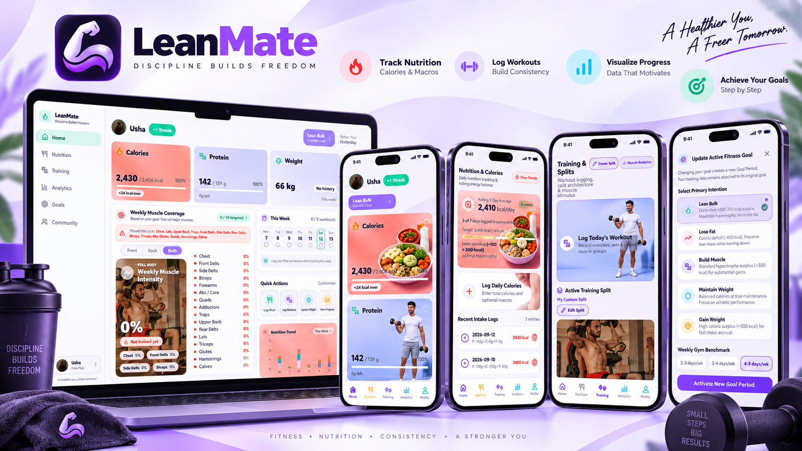

<p align="center">
  
</p>

# LeanMate Fitness App

LeanMate is a cross-platform fitness intelligence app built with Expo, React Native, TypeScript, and Firebase. It helps users track nutrition, log workouts, manage goal periods, monitor weekly muscle coverage, and keep progress visible through a polished mobile-first interface.

## Highlights

- **Daily dashboard** for calories, protein, weight, streaks, weekly training progress, and quick actions.
- **Nutrition tracking** with calorie and macro logs, rolling averages, target alignment, and trend charts.
- **Workout logging** with muscle selection, exercise picking, sets/reps capture, and PR transfer.
- **Training split builder** for user-created split days based on chosen muscle groups.
- **Weekly muscle coverage** with front/back muscle views and intensity-based visual feedback.
- **Goal periods** for lean bulk, fat loss, muscle gain, maintenance, and weight gain while preserving historical logs.
- **Profile and metrics** with avatar upload, height, weight, activity level, and training intensity.
- **Firebase-backed auth and data** using private per-user Firestore rules.

## Tech Stack

| Area | Tools |
| --- | --- |
| App framework | Expo SDK 52, React Native, Expo Router |
| Language | TypeScript |
| State | Zustand |
| Forms | React Hook Form, Zod |
| Backend | Firebase Auth, Firestore, Firebase Storage |
| UI | React Native, Expo Linear Gradient, Lucide icons |
| Platforms | Android, iOS, Web |

## Screens

- Authentication and onboarding
- Home dashboard
- Nutrition and calorie logs
- Nutrition trends
- Training and splits
- Workout logger and exercise picker
- Analytics and progress matrix
- Goals and goal history
- Profile and settings

## Getting Started

### Prerequisites

- Node.js 18+
- npm
- Expo CLI through `npx`
- Firebase project with Auth, Firestore, and Storage enabled

### Installation

```bash
npm install
```

Create a local `.env` file:

```bash
EXPO_PUBLIC_FIREBASE_API_KEY=your_api_key
EXPO_PUBLIC_FIREBASE_AUTH_DOMAIN=your_project.firebaseapp.com
EXPO_PUBLIC_FIREBASE_PROJECT_ID=your_project_id
EXPO_PUBLIC_FIREBASE_STORAGE_BUCKET=your_project.appspot.com
EXPO_PUBLIC_FIREBASE_MESSAGING_SENDER_ID=your_sender_id
EXPO_PUBLIC_FIREBASE_APP_ID=your_app_id
```

### Run Locally

```bash
npm run start
```

Run on Android:

```bash
npm run android
```

Run on web:

```bash
npm run web
```

## Firebase Rules

Firestore rules are included in `firestore.rules`. Deploy them with:

```bash
firebase deploy --only firestore:rules
```

Storage rules are included in `storage.rules`. Deploy them with:

```bash
firebase deploy --only storage
```

## Android Build

For an installable preview build:

```bash
npx eas-cli build -p android --profile preview
```

## Project Structure

```text
app/              Expo Router routes
src/components/   Reusable UI, dashboard, modal, chart, and training components
src/constants/    Theme, muscle, exercise, and visual asset constants
src/firebase/     Firebase config and data services
src/hooks/        App hooks
src/services/     Goal, calorie, nutrition, training, PR, and muscle engines
src/store/        Zustand auth, fitness, and UI stores
src/types/        Shared TypeScript models
assets/           App icons and visual assets
docs/             README media
```

## Environment Notes

Firebase values are read from `EXPO_PUBLIC_*` environment variables. The `.env` file is intentionally ignored and should not be committed.

## License

This project is currently private/proprietary. Add a license before distributing publicly.
